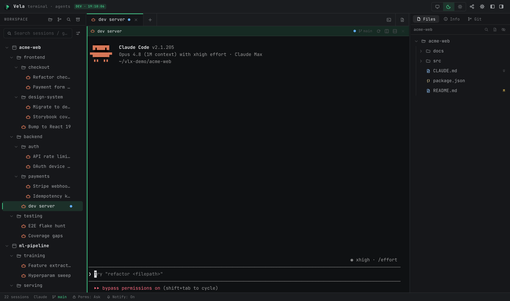

# heddle

**heddle** is the cockpit of the [heddle](https://github.com/mmayasaurus/heddle) agent-orchestration
system: a desktop terminal manager for fleets of coding agents (Claude Code, Codex, Gemini/Antigravity,
Cursor) that shows, next to the terminals themselves, what the fleet is doing and how much of each
provider's rate-limit window it has used — live per-provider windows, who is running what, and the recent
sub-tasks heddle routed to workers.

[](LICENSE)

> heddle is a fork of [VelaTerm](https://github.com/vlinx-io/VelaTerm) by VLINX Software (MIT),
> rebranded and extended by Very Good Fiber Goods (VGFG). Upstream copyright and license are retained
> in [LICENSE](LICENSE); the terminal-manager core described under *Inherited from VelaTerm* is theirs.



## What heddle adds

The **Fleet drawer** under the terminal stage (`src/layout/CenterPane/FleetDrawer.tsx`,
`src-tauri/src/heddle_stats/`) — read-only, desktop-only, refreshed on a timer:

- **Provider caps** — the *true* rolling 5-hour / 7-day rate-limit usage per provider, with live reset
  countdowns and a refresh button. Claude numbers come from a **passthrough statusline tap**
  (`docs/USAGE_TAP.md`, `scripts/heddle-usage-tap.mjs`) that records the exact payload Claude Code hands
  its statusline (per-account snapshots appear as their own rows); Codex from the `claudex-usage` cache;
  Gemini and Cursor sources are in progress. A summary bar shows one chip per provider (5-hour window %
  + reset).
- **Fleet roster** — named agents with their in-flight workers, scoped to the current project or all agents.
- **Dispatch ledger** — the most recent dispatches heddle routed to workers (`~/.heddle/ledger.db`):
  model, outcome, tokens, duration.
- **Window keeper** (`scripts/heddle-window-keeper.py`) — keeps each Claude account's 5-hour window
  ticking on a staggered schedule so a fresh window opens around the clock.

Plans, decisions and build order live in [ROADMAP.md](ROADMAP.md); the orchestration layer itself
(routing table, dispatcher, MCP server, ledger) lives in the [heddle](https://github.com/mmayasaurus/heddle)
repo. Work is tracked in Linear team **HED** (private).

## Inherited from VelaTerm

- **Session tree** — projects, arbitrarily nested groups, and sessions, with drag-and-drop reordering,
  search, and persisted collapse state.
- **Real PTYs** — every session is a full pseudo-terminal, kept alive in the background while you work
  elsewhere.
- **Agent awareness** — per-session status for supported agents (working, waiting for input, done),
  driven by the agents' own hook mechanisms, plus desktop notifications and session resumption.
- **Session spawning** — start a child session from inside a session, optionally in its own git
  worktree, and merge it back when the work is done.
- **Split panes**, **document / image / browser tabs**, **git integration**.
- **Remote access** — reach your sessions from a browser with end-to-end encrypted device pairing.
  (Upstream's SSH remote development — which provisions VelaTerm's server binary onto the remote host —
  is disabled in heddle builds until heddle ships its own server; the code stays, gated off.)
- **Themes and i18n** — light/dark themes that follow the system; 11 UI locales (English is complete;
  several locales still carry upstream `TODO translate` markers).

## Platforms

Developed and tested on macOS (Apple Silicon). Windows and Linux builds are inherited from upstream and
have not been exercised by heddle yet. There is no auto-updater and no Electron edition; heddle never
contacts a VelaTerm or heddle.app host.

## Tech stack

| Layer | Choice |
|-------|--------|
| Desktop shell | Tauri 2.x (Rust backend + system WebView) |
| PTY | `portable-pty` (wezterm) |
| Frontend | React 19 + TypeScript + Vite |
| Terminal | xterm.js with the fit, web-links, search, image, and unicode11 addons |
| State | Zustand |
| Persistence | SQLite via `rusqlite` (bundled), in the app data dir |
| Styling | Tailwind v4 with CSS-variable themes |

## Getting started

Prerequisites: Node.js, [pnpm](https://pnpm.io/), the [Rust toolchain](https://rustup.rs/), and git.
Tauri also needs its platform dependencies — see the
[Tauri prerequisites guide](https://tauri.app/start/prerequisites/).

```bash
pnpm install          # install frontend dependencies
pnpm dev:desktop      # build the Rust backend and open the desktop window
```

Other development modes:

```bash
pnpm dev:web          # headless backend + Vite, driven from a normal browser
pnpm dev:mobile       # same, with the mobile layout
pnpm dev:server       # cross-build the headless server binary and launch the desktop app against it (--build-only to just build)
pnpm dev:ls           # list running dev instances
pnpm dev:stop <label> # stop one instance by label
```

Every dev instance picks a random port and carries a label, so several can run side by side. The web
and mobile modes default to an isolated database under `.dev-data/`, leaving your real session tree
untouched.

Build and test:

```bash
pnpm build                                        # type-check and bundle the frontend
pnpm tauri build                                  # build the desktop application
pnpm test                                         # frontend tests (vitest)
pnpm lint                                         # eslint
cargo test --manifest-path src-tauri/Cargo.toml   # backend tests
```

CI runs the same gate on every PR (`docs/CI.md`); reviewer bots comment on PRs and every comment is
addressed before merge ([docs/TESTING-BAR.md](docs/TESTING-BAR.md) describes the test bar).

## Project layout

```
src/              React frontend
  layout/         three-column + bottom-bar regions; CenterPane/FleetDrawer.tsx = the heddle drawer
  store/          Zustand state
  ipc/            invoke / listen wrappers
  terminal/       xterm instance registry
  i18n/           translations, with English as the key source
  remote/         browser remote access and pairing
  mobile/         phone browser layout
src-tauri/src/    Rust backend
  heddle_stats/   Fleet drawer data: provider caps, roster, dispatch ledger views
  pty/            PTY manager
  db/             SQLite persistence
  agent/          agent detection, status, transcripts, spawning
  web/            embedded web server and command dispatch
  git.rs          git status probing
scripts/          dev scripts, the usage tap, the window keeper
skills/           agent skills exposed inside heddle sessions
docs/             USAGE_TAP.md, CI.md, TESTING-BAR.md, upstream manuals + changelog
```

## Documentation

- [ROADMAP.md](ROADMAP.md) — plan of record and decision log
- [Usage tap](docs/USAGE_TAP.md) — how the provider caps are captured
- [CI](docs/CI.md) — the PR gate and deterministic review tier
- [Testing bar](docs/TESTING-BAR.md) — behavioral tests, not toggle-toggles
- Upstream manuals (VelaTerm content; heddle-specific parts are above):
  [overview](docs/manuals/manuals-overview_20260709_2041.md) ·
  [getting started](docs/manuals/getting-started_20260709_2041.md) ·
  [AI agent sessions](docs/manuals/ai-agent-sessions_20260709_2041.md) ·
  [changelog](docs/changelog.md)

## Community

- **[Upstream: VelaTerm](https://github.com/vlinx-io/VelaTerm)** — the project this fork builds on.
- **[Issues](https://github.com/mmayasaurus/heddle-dashboard/issues)** — bugs and feature requests for heddle.

## Contributing

Two conventions matter most in this codebase:

1. **All user-facing strings are English and go through i18n** (`src/i18n/`). English is the key
   source; a missing key fails the type check. This includes strings returned from the Rust backend,
   which surface directly in the UI.
2. **All code comments are written in English.**

Any command touching the network or the filesystem must be asynchronous — synchronous Tauri commands
run on the main thread and freeze the UI. Tests must be behavioral — the switch must be shown to turn
the function on, not just the toggle ([docs/TESTING-BAR.md](docs/TESTING-BAR.md)).

## License

Copyright (c) 2026 Very Good Fiber Goods (VGFG) — the heddle fork.
Copyright (c) 2026 VLINX Software — the upstream [VelaTerm](https://github.com/vlinx-io/VelaTerm) code
this fork builds on. Both notices are retained in [LICENSE](LICENSE); heddle's own code — the fork and the
upstream code it builds on — is released under the [MIT License](LICENSE).

You may use, copy, modify, merge, publish, distribute, sublicense and sell copies of heddle, for
any purpose, as long as both copyright notices and the license text travel with it.

Bundled third-party assets keep their own licenses and are **not** relicensed as MIT: the Noto Sans
Symbols 2 subset (`src/assets/fonts/vlx-symbols.woff2`, SIL OFL 1.1 —
`src/assets/fonts/LICENSE-noto-sans-symbols-2.txt`), Noto Sans SC (`src/assets/fonts/NotoSansSC-*.ttf`, (c) Adobe with Reserved Font
Name 'Source', SIL OFL 1.1 — `src/assets/fonts/NotoSansSC-OFL.txt`), and JetBrains Mono (`@fontsource/jetbrains-mono`,
SIL OFL 1.1). Other npm/crate dependencies carry their own licenses per their packages.
