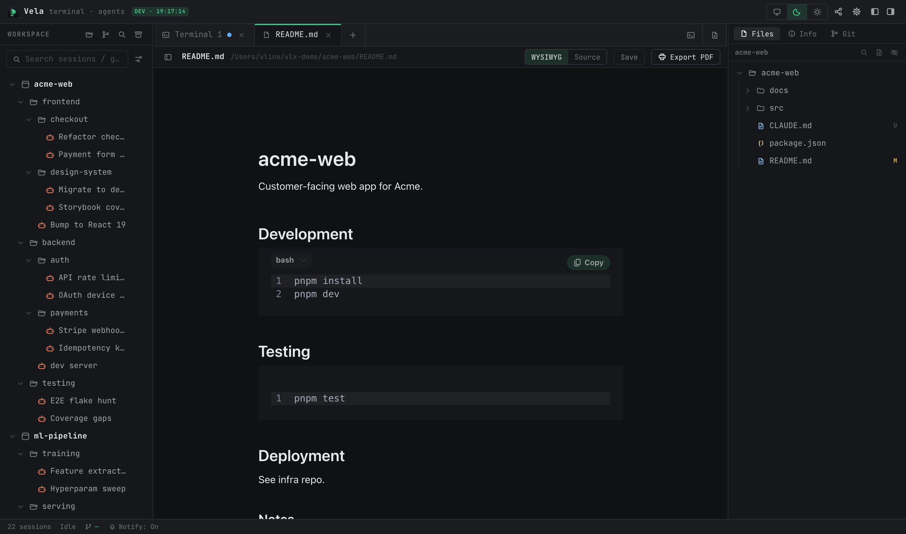

# Document & Browser Tabs

Created: 2026-07-09 20:41

> Center-pane tabs aren't only terminals. This chapter covers the other two kinds: document tabs (built-in Markdown / source editor) and browser tabs (embedded web pages). They live side by side with terminal tabs and are never displaced by opening a session.

## 1. Document tabs

### 1.1 Opening

Type `vopen <file>` in any session and a document tab opens in the center pane; inside a claude conversation the `/vopen` skill does the same (requires the Vela Skills toggle in Settings ▸ General). The view is chosen by file type:

| Type | View |
|------|------|
| md / markdown / mdx | Dual-mode editor: WYSIWYG by default, switchable to source mode |
| Images (png / jpg / gif / webp / svg, …) | Built-in image viewer (chunked loading for large files, fit-window / 1:1 toggle) |
| Everything else | Source editor with automatic syntax highlighting (~150 languages, matched by filename) |

### 1.2 Editing and saving

- The WYSIWYG / Source segmented control in the header switches modes at any time (markdown only); edits carry across.
- ⌘S or the Save button writes to disk. If the file changes on disk outside VelaTerm, a banner offers reload-or-ignore — no silent overwrites in either direction.
- Closing a tab with unsaved changes asks: Save & Close / Close Without Saving / Cancel.
- ⌘F brings up the unified search bar: find, replace, match-case — identical in both editor modes.
- The sidebar (toggleable, resizable) shows the document outline and the containing folder's file tree; click a file to switch to it.

### 1.3 New documents and PDF export

- The "new document" button in the tab bar's ＋ area (desktop only) opens a blank draft: not in the tree, not on disk; the first save goes through the system Save As dialog, and syntax highlighting follows the saved filename.
- "Export PDF" renders markdown to a vector PDF (auto-paginated, CJK fonts embedded) — Save As on desktop, direct download in the browser.

## 2. Browser tabs (desktop only)

The third tab kind embeds a real web page (native WebView) — handy for pinning docs sites, issue pages, or preview URLs into the workspace. Not available in remote / mobile clients.

**Four entry points**: the built-in-browser button in the tab bar's ＋ area, the ⌘⇧B shortcut, `vopen <url>` in a session, and right-click "New Browser Page" in the sidebar.

**Two forms**:

- **Scratch tab**: what ⌘⇧B or `vopen <url>` opens — a draft that isn't in the tree and doesn't survive restarts; right-click the tab to convert it into a persistent node.
- **Browser page node**: created via "New Browser Page" in the sidebar — a tree node whose URL is persisted, still there after a restart.

**Security boundary**: the embedded page is a fully isolated external website — it gets no VelaTerm internal permissions or credentials, and only http / https URLs are allowed.

## 3. How the three tab kinds coexist

- Terminal / document / browser tabs share one tab bar; ⌘1–9 switches among all of them alike.
- Opening a session from the tree only ever reuses **session tabs** — documents and browser tabs are never displaced.
- Documents and browser tabs have no split panes; ⌘W closes them directly (with the three-way confirm for dirty documents).
