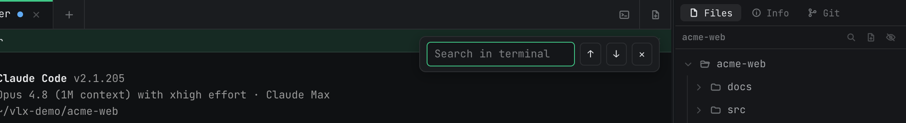

# Terminal Usage

Created: 2026-07-09 20:41

> This chapter covers the terminal itself: input/output, in-terminal search, copy/paste and images, the `vopen` command, shell selection on Windows, and session recording.

## 1. Basics

A terminal session is a real shell (system default shell on macOS / Linux; cmd by default on Windows, switchable — see §5). The working directory defaults to the project root and can be changed in the session's edit form, which also offers a "Startup command" — run automatically every time the session starts (e.g. `pnpm dev`).

Typing latency is specifically engineered: when agents flood the screen, input takes priority and background tabs are throttled, so the foreground never lags behind your keystrokes. If a TUI ever looks glitched after a tab switch, the redraw button in the pane header forces a full repaint.

## 2. In-terminal search (⌘F)

Search the current terminal's scrollback, with next/previous navigation:



To search across sessions and history, use global search (⌘⇧F) — see [Interface & Session Management](interface-and-sessions_20260709_2041.md) §8.

## 3. Copy and paste

- Select to highlight; the context menu offers copy / paste, and the usual ⌘C / ⌘V work.
- Inside TUI programs that capture the mouse (vim, htop), hold Option/Alt while dragging to force normal text selection.

**Image paste** is the channel for feeding images to agents: paste or drag a screenshot / image file into the terminal, and VelaTerm writes the image to a temp location and types its **file path** into the terminal — exactly what CLIs like claude expect. Related settings: "Image paste" chooses between "Upload as file" (always materialize to a path) and "Agent default"; "Auto-clean pasted images" periodically clears those temp images, with a "Clean now" button.

## 4. `vopen`: open files and pages from the terminal

Every session's PATH carries three small commands (zero install): `vopen`, `vspawn`, `vspawn-tree`. Note these are the terminal commands — the same-named `/` skills used *inside* claude conversations are a separate thing and require the Vela Skills toggle in Settings ▸ General. `vopen` sends things to the center pane:

```bash
vopen README.md          # markdown → WYSIWYG editor
vopen src/main.rs        # source code → syntax-highlighted editor
vopen diagram.png        # image → built-in image viewer
vopen https://crates.io  # URL → built-in browser tab (desktop only)
```

Document tabs in full (dual-mode editing, find & replace, PDF export): [Document & Browser Tabs](document-and-browser-tabs_20260709_2041.md). Spawning with `vspawn`: [Session Spawning & Git Collaboration](session-spawning-and-git_20260709_2041.md).

## 5. Shell selection (Windows only)

On Windows, terminal sessions can explicitly pick a shell — PowerShell / pwsh / cmd / Git Bash, plus every installed WSL distribution — via the New submenu, the session edit form's dropdown, or right-click "Shell ▸"; a running session applies the change on restart. Settings ▸ Terminal ▸ "Default shell" sets the default for new sessions.

WSL entries appear as `WSL: <distribution>` only when `wsl --list --quiet` reports an installed distribution. Choosing one launches that exact distribution and maps the session's Windows project directory into WSL. WSL support currently applies to plain terminal sessions; VelaTerm-managed agent sessions continue to use the Windows host shell so their hooks, executable paths and built-in commands remain reliable. The host-side `vopen` / `vspawn` shims are not currently exposed inside WSL terminals.

About the bundled Git Bash: the full installer ships the complete version (git, ssh, perl included); the min installer ships a core subset, and missing commands prompt an on-demand download of the full version (also available via right-click "Download full Git Bash"). Agent sessions are unaffected — they always use PowerShell.

macOS / Linux have no shell picker; sessions use the system default shell (`$SHELL`).

## 6. Session recording

Settings ▸ Advanced ▸ "Record session logs" (off by default). When enabled, terminal content is recorded to a local file from the moment a session starts (50MB cap per session). It buys you two things:

- Archived sessions can replay the terminal exactly as it looked;
- Global search can find plain-terminal output (agent conversations don't need recording — they have transcripts).

Recording files are cleaned up when the session is deleted.

## 7. Common shortcuts

macOS defaults below; on Windows / Linux, replace ⌘ with Ctrl+Alt (with a couple of exceptions — check the Settings page). Everything except ⌘1–9 and the font-size trio is rebindable in Settings ▸ Shortcuts.

| Action | Shortcut |
|--------|----------|
| Open project | ⌘O |
| New scratch terminal | ⌘T |
| New browser tab | ⌘⇧B |
| Close pane / tab | ⌘W |
| Split right / split down | ⌘D / ⌘⇧D |
| Find in terminal | ⌘F |
| Search all sessions | ⌘⇧F |
| Save document | ⌘S |
| Go to tab N | ⌘1–9 (fixed) |
| Terminal font larger / smaller / reset | ⌘+ / ⌘- / ⌘0 (fixed) |
